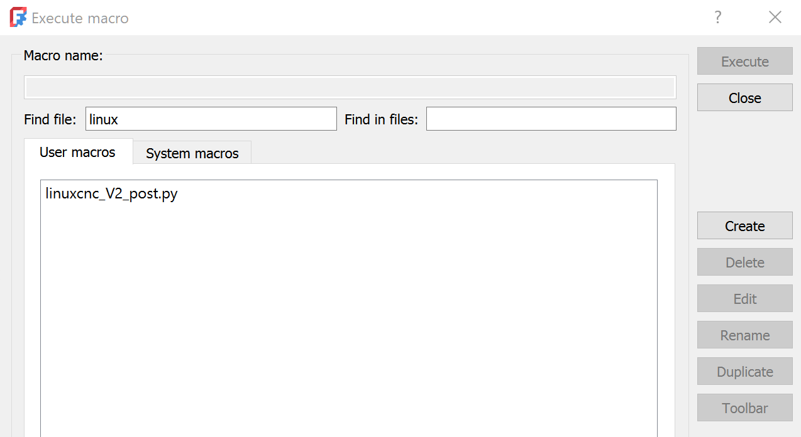

# FreeCAD CNC postprocessor for metalab CNC

For those who need extra dwell time inserted after the spindle starts, this postprocessor gives us --dwell "1.234" 

## Installation

1. Navigate to the menu Macro → Macros...
2. Press the "Create" button 
3. A new dialog asking for a file name pops up. Enter "linuxcnc_V2_post.py" and press Ok.
4. A new window pops up, containing a text editor.
5. Copy the contents of the file "linuxcnc_V2_post.py" from this repository into the clipboard and paste it into this text editor.
6. File > Save 
7. Restart FreeCAD.
8. Job / Output / Processor: select `linuxcnc_V2`
9. generate GCode like normal

Many Thanks to anlumo from https://github.com/Metalab/freecad-cnc-postprocessor for these instructions.
